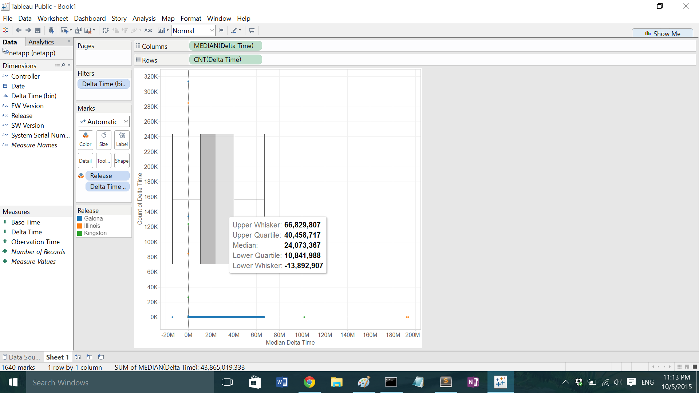
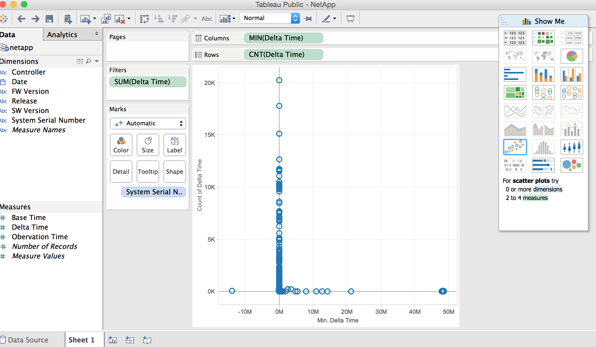
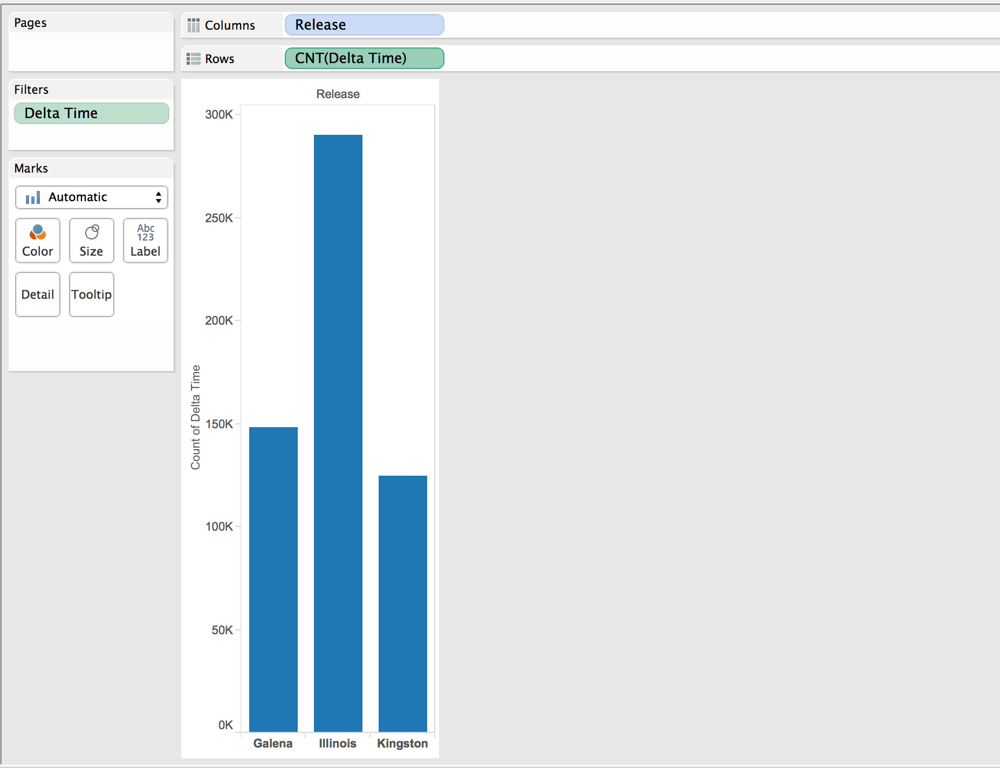
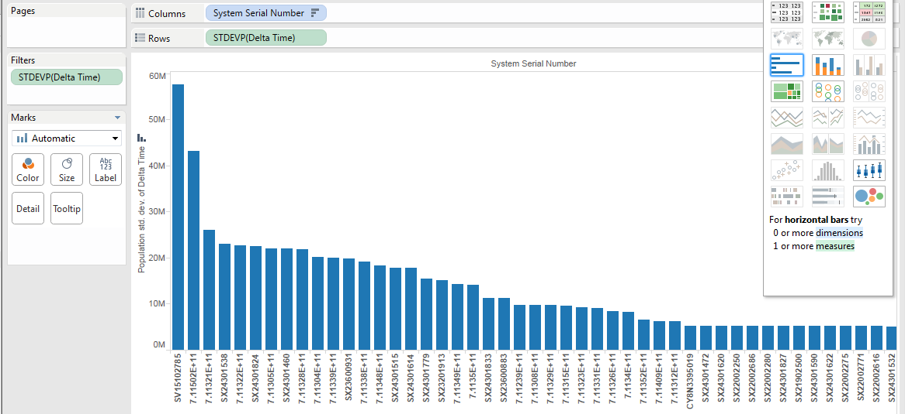

# NetApp

Brian McKean, a senior engineer at NetApp, gave a talk about his company in class.
He shared a data problem for our class to help solve.

# Tool
Tableau

# Authors

This report is prepared by
* [Caleb Hsu](https://github.com/calebhsu/)
* [Andrew Linenfelser](https://github.com/Linenfelser)
* [Zhili Yang](https://github.com/zhya215)
* [Andrey Shprengel](https://github.com/AndreyShprengel)
* [Andrew Berumen](https://github.com/anbe6083)

#  What is the distribution of the most common delta times per bin?

Each point on the graph indicates the number of appearances of the median delta time (per time bin of 80,000), in addition to a box-and-whisker plot that specifies where the data is clustered.

# What are lower limits of the delta times? 

# Which release did the worst job?

# How much usable data (+ / - an hour) is there?

# Are delta times consistent across serial numbers?

# Further Analysis

Our team determines the following questions are too complex for Tableau and
require custom scripts to be written.

* Pick out the system serial numbers that have useable data and return the systems that have consistently accurate data.
* Determine an error range for acceptable delta times to indicate whether a system is reporting according to standards or not.
* Determine the proportion of usable delta times in each release.
* Find the trend of delta times over time for specific systems.
* Decide the primary cause of poor delta times, whether release, FW version, SW version, or controllers.